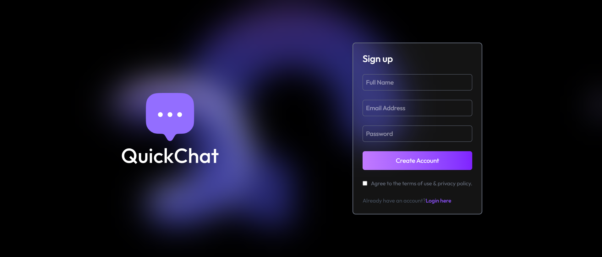
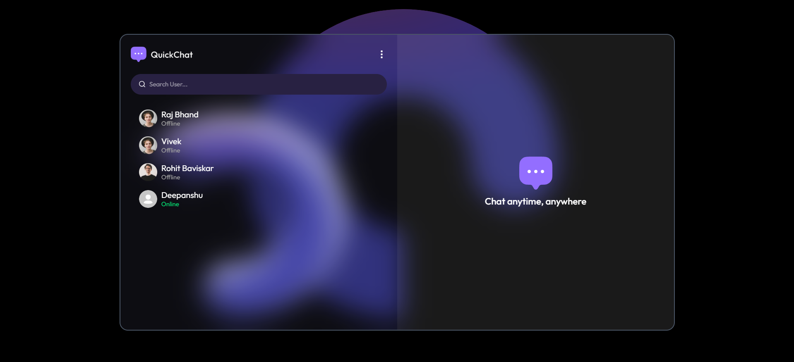
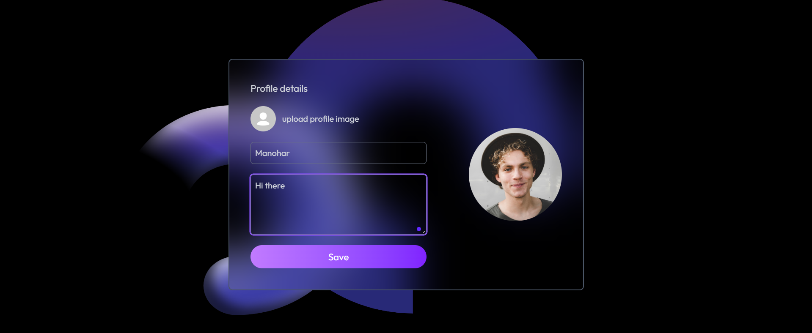
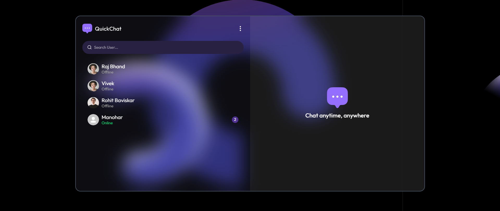
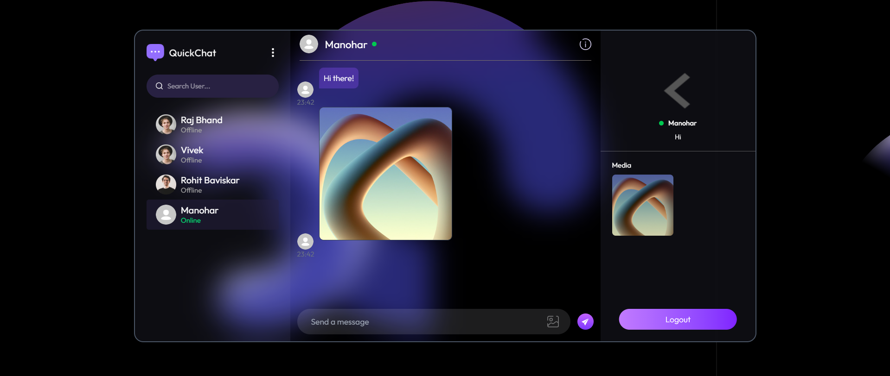

# 💬 MERN Real-Time Chat Application

A full-stack real-time **Chat Web App** built using the **MERN Stack** — **MongoDB, Express.js, React.js, Node.js**, and **Socket.IO** for real-time communication. This application allows users to sign up, log in, search for other users, and instantly exchange messages in real-time — all without refreshing the page!

The app is deployed for free using **Vercel** and is accessible from anywhere. Built with scalability, responsiveness, and simplicity in mind.

---

## 🔥 Key Features

### 👤 User Features
- 🔐 Authentication (Signup/Login)
- 🔍 Search and Chat with other users
- 💬 Real-time one-on-one messaging
- 🧾 Chat history for each conversation
- 🟢 Online/Offline User Status
- 🚫 Block/unblock users

### 🛠 Functional Features
- ⚡ Instant delivery of messages using **Socket.IO**
- 🔄 Persistent chat data via **MongoDB**
- 📲 Responsive design (mobile & desktop)

---

## 🧰 Tech Stack

### 🖥️ Frontend
- ⚛️ **React.js** – User Interface
- 🎨 **Tailwind CSS** – Styling
- 🧠 **Context API / Zustand** – Global state management
- 📡 **Socket.IO Client** – Real-time communication
- 🌐 **Axios** – REST API calls

### 🛠️ Backend
- 🧠 **Node.js** – Runtime environment
- 🚂 **Express.js** – Backend routing & APIs
- 📡 **Socket.IO Server** – Bi-directional communication

### 🗃️ Database
- 🍃 **MongoDB** – Document-based NoSQL database
- 🧩 **Mongoose** – Object Data Modeling for MongoDB

### 🔐 Authentication
- 🔑 **JWT (JSON Web Token)** – Token-based login system
- 🛡️ **Middleware** – Route protection and user validation

### ☁️ Deployment
- 🎯 **Vercel** – Frontend deployment
- ⚙️ **Render / Railway** – Backend & DB deployment

---
## 📷 Screenshots
### Preview
![preview].(preview.png)
### 🔐 Sign In / Login Page  

### 🏠 Home Page (User List & Chat Interface)  

### 🔍 Profile Page ( Name , Photo , Bio )

### ✉️ Manohar (Sender) Sends Message to Deepanshu  

### 📥 Deepanshu (Receiver) Receives Message from Manohar  

### 💬 Real-Time Messaging in Action  

